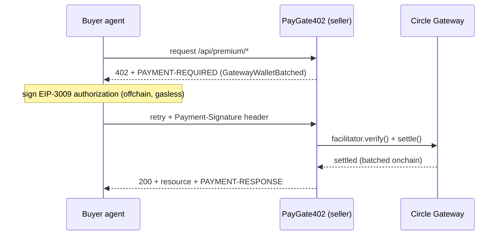

# PayGate402

**Turn any API route into an agent-payable, sub-cent USDC storefront on Circle Arc.**

PayGate402 is a drop-in `withPaywall()` wrapper for Next.js routes. An unpaid request gets
`HTTP 402 Payment Required`; an autonomous agent retries with a signed authorization and gets the
resource. Payments settle in **USDC on Arc Testnet** via **Circle Gateway batching** — which
amortizes gas across thousands of payments and makes prices as low as **$0.000001** economically
real. No accounts, no API keys: **payment is identity**.


> Each payment is tagged with the buyer's **on-chain agent identity** (ERC-8004 #668408) — a
> verifiable identity, not just a wallet — while the actual spend comes from disposable per-run wallets.

> Why Arc specifically? Gateway batches many offchain EIP-3009 authorizations into a single onchain
> settlement (the `GatewayWalletBatched` x402 scheme), and USDC is Arc's native gas token. On a
> generic chain, per-call gas would dwarf a $0.001 charge — this pattern only pencils out here.

## Demo

A real run: an autonomous buyer agent — presenting its **on-chain ERC-8004 identity (agent #668408)** —
discovers and pays for three endpoints in sub-cent USDC, settled via Gateway batching, spending from
disposable per-run wallets. The dashboard above shows the live revenue tagged with that identity. In an
earlier high-volume run the same agent made **429 nanopayments** totaling **$0.50 USDC** before
auto-stopping at its `--limit`. The landing page lists the endpoints:


Any unpaid request returns `402` with a base64 `PAYMENT-REQUIRED` header describing how to pay:

```text
$ curl -i http://localhost:3000/api/premium/fx-rate            # unpaid
HTTP/1.1 402 Payment Required
payment-required: eyJ4NDAyVmVyc2lvbiI6Mi...      # base64 — decodes to:

  scheme   = exact
  network  = eip155:5042002                       # Arc Testnet
  amount   = 500                                  # = $0.0005 USDC (6 decimals)
  payTo    = 0x575162bE...                         # the seller
  extra    = { name: "GatewayWalletBatched", verifyingContract: 0x0077777d7EBA…19B9 }
```

The agent signs an EIP-3009 authorization for that requirement and retries with a
`Payment-Signature` header; the server verifies + settles via Gateway and returns `200` + the data:

```text
$ npm run agent -- --limit 0.5
Ephemeral agent wallet: 0x8e3c22…
Acting as ERC-8004 on-chain agent #668408 (0x8eaa…B607)
Depositing 1 USDC into Gateway Wallet... done (available: 1)
#1 POST summarize -> 0.002 USDC (388ms)  [spent: 0.002000/0.500000]
#2 POST keywords  -> 0.001 USDC (438ms)  [spent: 0.003000/0.500000]
#3 GET  fx-rate   -> 0.0005 USDC (361ms) [spent: 0.003500/0.500000]
...
Spent 0.501500 / 0.500000 USDC (limit reached)
```

## How it works



Paywalling a route is one line:

```ts
import { withPaywall } from "@/lib/paywall";
const handler = async (req: NextRequest) => NextResponse.json({ ... });
export const POST = withPaywall(handler, "$0.002", "/api/premium/summarize");
```

## On-chain agent identity (ERC-8004)

A wallet address is anonymous and disposable. PayGate402's buyer agent can instead carry a **verifiable
on-chain identity** via [ERC-8004](https://docs.arc.io/build/agentic-economy.md) — Arc's native registry
for agent identity and reputation.

```bash
npm run register-agent      # mints an ERC-8004 identity NFT for the buyer wallet, writes AGENT_ID
```

This calls `register(agentURI)` on Arc's IdentityRegistry
(`0x8004A818BFB912233c491871b3d84c89A494BD9e`), pointing at the agent card served at
`/.well-known/agent-card.json`, and mints an identity NFT. The agent then presents that identity on
every purchase (`X-Agent-Id` / `X-Agent-Address` headers), the paywall records it, and the dashboard
links each payment to the [agent's on-chain identity](https://testnet.arcscan.app/token/0x8004A818BFB912233c491871b3d84c89A494BD9e/instance/668408).

The result: **an agent with a stable, verifiable identity autonomously buys APIs** — while paying from
throwaway per-run spend wallets. Identity and spend are decoupled. (A natural next step is to pair this
with the ERC-8004 ReputationRegistry so sellers can price or gate by an agent's track record.)

## What's in here

| Path | What it is |
| --- | --- |
| `lib/paywall.ts` | **The reusable core.** `withPaywall(handler, price, endpoint)` — x402 402 + Gateway verify/settle. |
| `lib/store.ts` | Zero-dependency JSON payment store (swap for a DB later). |
| `lib/arc.ts` / `lib/text.ts` | Arc constants; zero-dep summarizer/keyword helpers. |
| `lib/erc8004.ts` | ERC-8004 IdentityRegistry addresses + ABI (on-chain agent identity). |
| `public/.well-known/agent-card.json` | The buyer agent's metadata card (its `agentURI`). |
| `app/api/premium/*` | Three paid routes: `summarize` ($0.002), `keywords` ($0.001), `fx-rate` ($0.0005). |
| `app/api/payments`, `app/api/gateway/balance` | Dashboard data (revenue store + seller Gateway balance). |
| `app/page.tsx`, `app/dashboard/page.tsx` | Landing + live revenue dashboard. |
| `agent/buyer.mts` | Autonomous buyer agent (`GatewayClient`) with a `--limit` spend cap. |
| `scripts/generate-wallets.mts` | Creates seller + buyer wallets into `.env.local`. |
| `scripts/register-agent.mts` | Mints the buyer's ERC-8004 on-chain identity, writes `AGENT_ID`. |

## Quick start

```bash
npm install
npm run generate-wallets         # writes SELLER_* and BUYER_* into .env.local
# Fund BUYER_ADDRESS with Arc Testnet USDC at https://faucet.circle.com
npm run register-agent           # (optional) mint the buyer's ERC-8004 on-chain identity
npm run dev                      # seller app on http://localhost:3000
npm run agent -- --limit 0.5     # buyer agent pays your endpoints until 0.5 USDC spent
```

Watch payments stream in at `http://localhost:3000/dashboard`.

### Verify the 402 without paying

```bash
curl -i http://localhost:3000/api/premium/fx-rate          # -> 402 + PAYMENT-REQUIRED header
```

## Arc Testnet facts

- Chain ID `5042002` · RPC `https://rpc.testnet.arc.network` · Explorer `https://testnet.arcscan.app`
- USDC `0x3600000000000000000000000000000000000000` (6-decimal ERC-20 / 18-decimal native gas)
- Gateway Wallet `0x0077777d7EBA4688BDeF3E311b846F25870A19B9` · CCTP domain `26`
- Gateway facilitator (testnet): `https://gateway-api-testnet.circle.com`

## Troubleshooting

**`Payment verification failed` / `authorization_validity_too_short`** — Circle Gateway-testnet
requires the EIP-3009 authorization to stay valid for at least `minValiditySeconds` (currently
**604800 = 7 days**, see `GET https://gateway-api-testnet.circle.com/v1/x402/supported`). The client
builds the window as `maxTimeoutSeconds + 600`, so `maxTimeoutSeconds` in `lib/paywall.ts` must be
≥ ~604200. We use **691200 (8 days)**. Heads-up: the upstream `circlefin/arc-nanopayments` sample —
and even the SDK's own helper — still ship the stale `345600` (4 days), which Gateway now rejects.

To inspect what Gateway accepts for a chain:

```bash
curl -s https://gateway-api-testnet.circle.com/v1/x402/supported \
  | node -e "let s='';process.stdin.on('data',d=>s+=d).on('end',()=>console.log(JSON.stringify(JSON.parse(s).kinds.find(k=>k.network==='eip155:5042002').extra,null,2)))"
```

When verification fails, the real reason is logged server-side (and to
`.next/dev/logs/next-development.log`) as `[paywall] verify failed (...): <reason>`.

## Notes & caveats

- **Testnet only.** Never commit private keys (`.env.local` and `.data/` are gitignored).
- Circle **Agent Wallet spending policies are mainnet-only**; on testnet the agent enforces the cap
  itself via `--limit`.
- Settlement IDs shown in the dashboard are Gateway **batch references** (off-chain batched), not
  per-payment on-chain tx hashes — that's the whole point of batching.
- The `fx-rate` route is an indicative mock — wire it to Arc's native **StableFX** (FxEscrow
  `0x867650F5eAe8df91445971f14d89fd84F0C9a9f8`) for executable quotes.
- `withPaywall` records to a JSON file (`.data/payments.json`) so the app runs with zero external
  services. For production, swap `lib/store.ts` for a real database.

## Credits

Built on Circle's [`@circle-fin/x402-batching`](https://www.npmjs.com/package/@circle-fin/x402-batching).
Paywall + agent structure adapted from [`circlefin/arc-nanopayments`](https://github.com/circlefin/arc-nanopayments)
(Apache-2.0).
