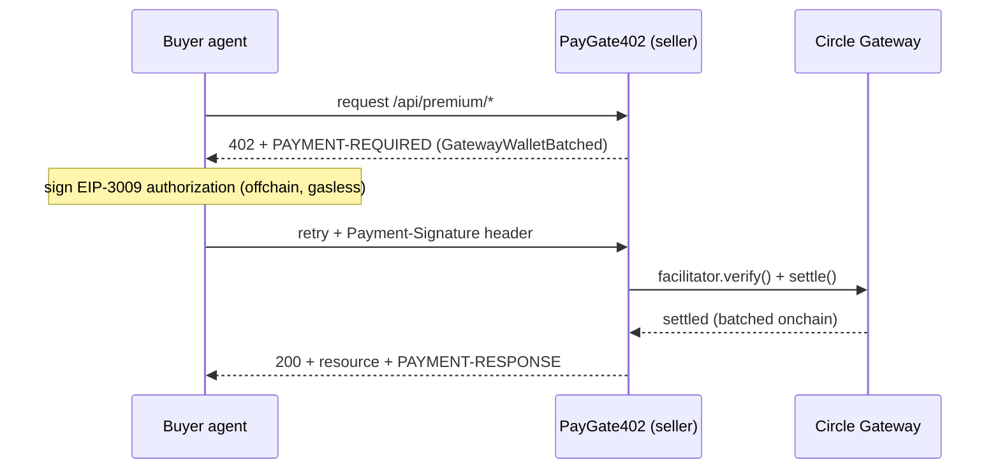
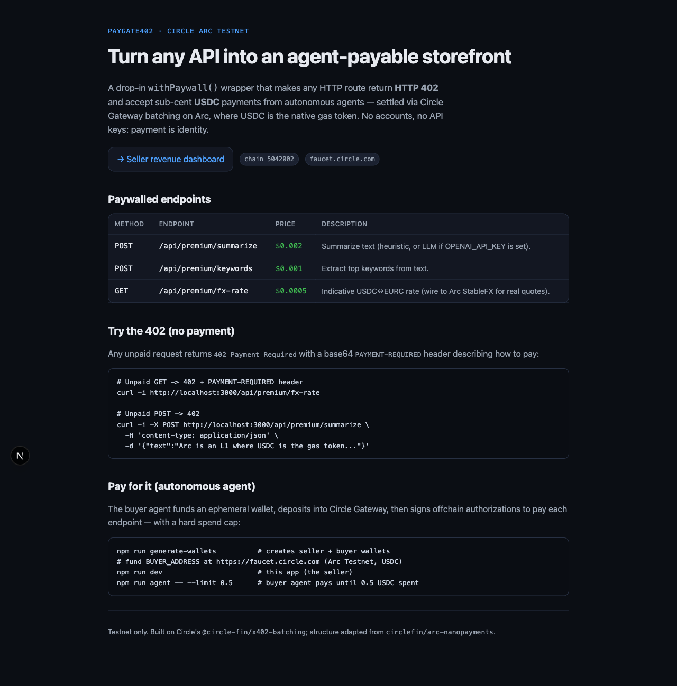
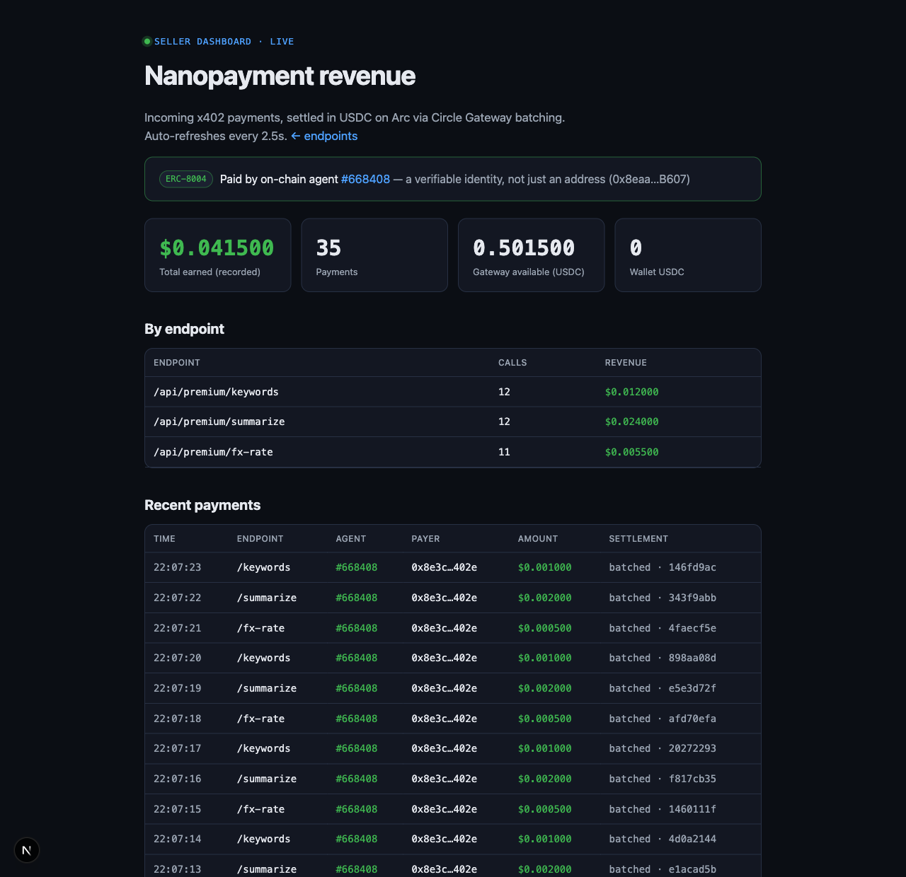
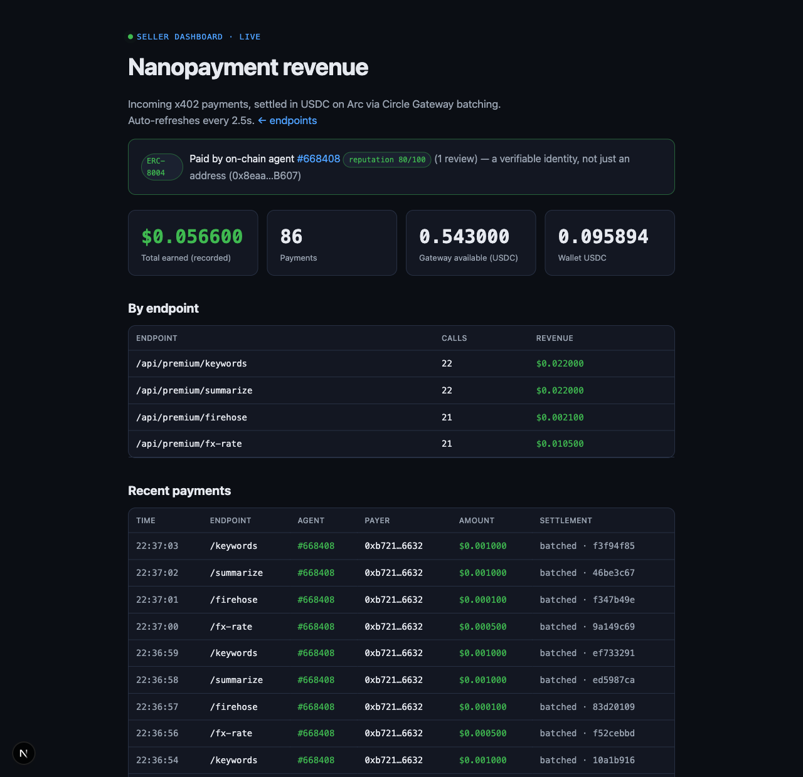
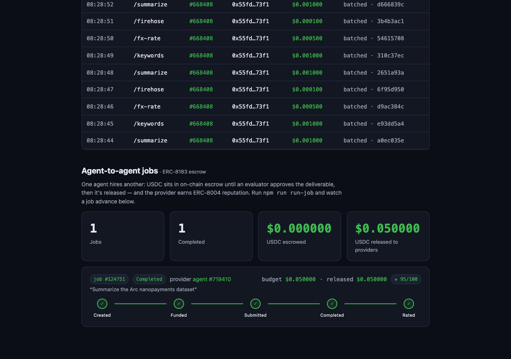
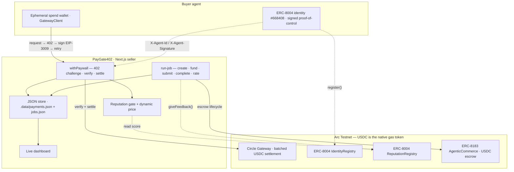

# PayGate402: building an agent-native storefront on Circle Arc

*How four of Arc's agentic-economy primitives — x402 payments, ERC-8004 identity & reputation, and
ERC-8183 job escrow — stack into one coherent loop, settled in USDC, on a weekend.*

---

## The problem: the web has no checkout for agents

The web was built for humans with credit cards. An autonomous agent that wants to buy a single API
call has no good way to pay for it: signing up for an account, provisioning an API key, and topping up
a balance are all human-shaped rituals. And the amounts are wrong — an agent might want to pay
**$0.0005** for one call, but card networks have a floor of cents and gas on a generic chain would dwarf
the charge.

[x402](https://x402.org) revives the long-dormant `HTTP 402 Payment Required` status code as the answer:
a server replies `402` with a machine-readable description of *how to pay*, the client pays inline, and
retries. No accounts, no API keys — **payment is identity**.

The catch is settlement. For sub-cent payments to be real, the cost of settling them has to round to
zero. That is exactly what **Circle Arc** provides, and why PayGate402 is built on it.

## Why Arc

[Arc](https://arc.io) is an EVM L1 where **USDC is the native gas token**, and it ships **Circle Gateway**
— which batches many off-chain [EIP-3009](https://eips.ethereum.org/EIPS/eip-3009) authorizations into a
*single* on-chain settlement (the `GatewayWalletBatched` x402 scheme). Two consequences make nanopayments
pencil out:

1. The buyer signs a **gasless** authorization off-chain; it never pays per-call gas.
2. The seller settles **thousands of payments in one batch**, so the on-chain cost per payment rounds to
   nothing.

On a generic chain, per-call gas would swamp a $0.001 charge. Here it doesn't. That single fact is what
makes everything below economically real instead of a toy.

## The core: `withPaywall()`

The whole payments plane is one wrapper. You take any Next.js route handler and wrap it:

```ts
import { withPaywall } from "@/lib/paywall";

const handler = async (req: NextRequest) => NextResponse.json({ rate: 1.08 });
export const GET = withPaywall(handler, "$0.0005", "/api/premium/fx-rate");
```

An unpaid request now returns `402` with a base64 `PAYMENT-REQUIRED` header describing the requirement —
scheme, network (`eip155:5042002`), amount in 6-decimal USDC, the seller's `payTo`, and the Gateway
verifying contract. The agent signs an EIP-3009 authorization for that exact requirement, retries with a
`Payment-Signature` header, and the server verifies + settles via Gateway before returning `200` and the
data.



In an early high-volume run, a single buyer agent made **429 nanopayments totaling $0.50 USDC** before
auto-stopping at its spend cap — each call a real settlement on Arc testnet.



## Plane 2: who is paying? (ERC-8004 identity)

A wallet address is anonymous and disposable. The interesting question for a seller isn't "which address
paid" but "**which agent** paid" — so you can build a relationship across many throwaway spend wallets.

[ERC-8004](https://docs.arc.io/build/agentic-economy.md) ("Trustless Agents") is Arc's native registry for
agent identity. `register(agentURI)` on the `IdentityRegistry` mints an ERC-721 identity NFT pointing at
the agent's metadata card (served at `/.well-known/agent-card.json`). PayGate402's buyer mints one
(**agent #668408**) and then presents it on every purchase via `X-Agent-Id` / `X-Agent-Address` headers.

The design decision that makes this practical: **identity is decoupled from spend.** The stable identity
lives on a funder wallet; the actual USDC comes from ephemeral per-run wallets. The agent is recognizable
without reusing keys that hold funds.



## Plane 3: pricing the relationship (ERC-8004 reputation)

Identity unlocks the real payoff: the seller can **price and gate** endpoints by an agent's on-chain
reputation, read from the ERC-8004 `ReputationRegistry`:

```ts
// reputable agents (score >= 60) pay half price
withPaywall(handler, "$0.002", "/api/premium/summarize", { discount: { atScore: 60, price: "$0.001" } });

// high-frequency feed only reputable agents may call (HTTP 403 below the bar)
withPaywall(handler, "$0.0001", "/api/premium/firehose", { minScore: 60 });
```

Reputation comes from feedback. The **seller** rates the agent after it pays reliably (ERC-8004 forbids
rating your own agent, so a seller — a different wallet than the agent's owner — is a valid reviewer).
Once feedback lands, the gate flips live:

```text
# before feedback (reputation 0)
GET  /api/premium/firehose     -> 403 reputation gate (requiredScore 60, yourScore 0)
POST /api/premium/summarize    -> 402 ... amount 2000   ($0.002, full price)

# after feedback (reputation 80)
GET  /api/premium/firehose     -> 402 ... amount 100    ($0.0001, unlocked)
POST /api/premium/summarize    -> 402 ... amount 1000   ($0.001, 50% discount)
```



### A security lesson, learned the hard way

The first version trusted the `X-Agent-Id` header — and an automated security review correctly flagged it
as spoofable: anyone could claim a reputable agent's id and get the discount. The fix is
**proof-of-control**: the caller must also send an `X-Agent-Signature` over a timestamped message; the
server recovers the signer and checks it equals the agent's on-chain owner (`ownerOf` /
`getAgentWallet`) before trusting the claimed id. A spoofed id or forged signature falls through to
anonymous — full price, gated endpoints denied.

```text
spoof id, NO signature   -> firehose 403, summarize $0.002   (no benefit)
forged signature         -> firehose 403, summarize $0.002   (signer != owner)
valid owner signature    -> firehose 402, summarize $0.001   (unlocked + discount)
```

The takeaway generalizes: **in agentic commerce, a claimed identity is worthless without a proof you can
verify on-chain.** Headers are hints; signatures recovered against the registry are truth.

## Plane 4: agents hiring agents (ERC-8183 jobs)

The paywall is "an agent buys an API call." [ERC-8183](https://docs.arc.io) ("AgenticCommerce") is the
next rung: "an agent **hires another agent to do a job**", with USDC held in on-chain escrow until the
work is approved. It reuses the same ERC-8004 identities, closing the loop:

> **identity → get hired → deliver → get paid → earn reputation → get hired again**

The lifecycle has three roles — a **client** who funds escrow, a **provider** who does the work, and an
**evaluator** who approves it and releases payment:

```
createJob(provider, evaluator, expiredAt, description, hook)   // client   -> status Open
setBudget(jobId, amount)                                       // provider  sets the price
approve(USDC) + fund(jobId)                                    // client    -> status Funded (escrowed)
submit(jobId, keccak256(deliverable))                          // provider  -> status Submitted
complete(jobId, keccak256(reason))                             // evaluator -> status Completed, USDC released
```

`npm run run-job` runs the whole thing on testnet: the client (the same `BUYER` wallet) hires a
freshly-registered provider agent, funds escrow, the provider submits a deliverable hash, an evaluator
releases payment, and the client leaves ERC-8004 reputation feedback. A verified run minted provider
**agent #719410**, created **job #124751**, escrowed and released **0.05 USDC**, and rated the provider
**95/100**.

### Making the job loop *visible*

Logs are ephemeral; a portfolio needs to *show* the loop. So `run-job` now **persists each phase** to a
zero-dependency JSON store (`lib/jobs.ts`, a deliberate sibling of the payment store) as the transactions
confirm. The dashboard polls `/api/jobs` every 2.5s, so a job **animates live** through a lifecycle
stepper while the script is still running — `Created → Funded → Submitted → Completed → Rated`, every node
a link to the on-chain transaction that advanced it, the provider's earned reputation shown as a ★ score:



Two small but real engineering details made this clean. First, the job store is kept **dependency-free**
(no lib-to-lib imports) so the *exact same file* resolves correctly under both the Next.js bundler
(`@/lib/jobs`) and Node's `.ts` type-stripping when the `run-job` script imports it (`../lib/jobs.ts`).
Second, because the writer (the `run-job` process) and the reader (the Next.js server) are *separate
processes*, an in-process mutex can't coordinate them — so instead of locking, each write goes to a temp
file and is **atomically renamed** over `.data/jobs.json`. A dashboard poll that lands mid-write always
reads a complete snapshot: either the old file or the new one, never a torn one.

## The whole picture



Each plane is independently useful, but the value is in the stack: an agent with a **verifiable
identity** that **earns reputation** by paying reliably, is **priced and gated** by that reputation, and
can be **hired for escrowed work** that feeds *back* into its reputation — every step settling in USDC,
every step observable.

## Three gotchas worth writing down

Building on a young chain means the docs and the network don't always agree. Three cost real debugging
time:

1. **Gateway now requires a 7-day authorization validity.** Gateway-testnet's `/v1/x402/supported`
   demands `minValiditySeconds: 604800` for the EIP-3009 authorization. The client builds the window as
   `maxTimeoutSeconds + 600`, so `maxTimeoutSeconds` must be ≥ ~604200 — PayGate402 uses **691200 (8
   days)**. The upstream sample *and the SDK's own helper* still ship the stale `345600` (4 days), which
   Gateway rejects with `authorization_validity_too_short`. If your verify silently fails, this is why.

2. **`getSummary` reverts on an empty client set.** The ERC-8004 `ReputationRegistry.getSummary(agentId,
   clientAddresses, …)` reverts if `clientAddresses` is empty — you have to call `getClients(agentId)`
   first and pass the result.

3. **Settlement IDs are batch references, not tx hashes.** Because Gateway batches, the id returned per
   payment is an off-chain **batch UUID**, not an on-chain transaction hash. That's the whole point of
   batching — but it means the dashboard shows "batched · `<uuid>`" for individual payments, while
   *jobs* (which are direct contract calls) link to real txs.

## What's next

This is a testnet MVP, intentionally scoped to a weekend, with honest edges: the JSON store should become
a real database; the `fx-rate` endpoint is a mock that should be wired to Arc's native **StableFX**; the
job "evaluator" is a wallet clicking approve, where production would wire an AI evaluator or a dispute
`hook` that actually checks the deliverable; and the agent's spend cap is enforced client-side because
Circle's Agent Wallet spending policies are mainnet-only.

But the spine is real and verified on-chain: **identity, reputation, payments, and escrowed jobs, all in
USDC, all on Arc.** The code is one `withPaywall()` wrapper plus a handful of small, swappable libs.

→ **Code & quick start:** [the repository README](../README.md)
→ **Jobs deep-dive:** [docs/ERC-8183-jobs.md](ERC-8183-jobs.md)

*Built on Circle's [`@circle-fin/x402-batching`](https://www.npmjs.com/package/@circle-fin/x402-batching);
paywall + agent structure adapted from [`circlefin/arc-nanopayments`](https://github.com/circlefin/arc-nanopayments)
(Apache-2.0). Testnet only — never commit private keys.*
